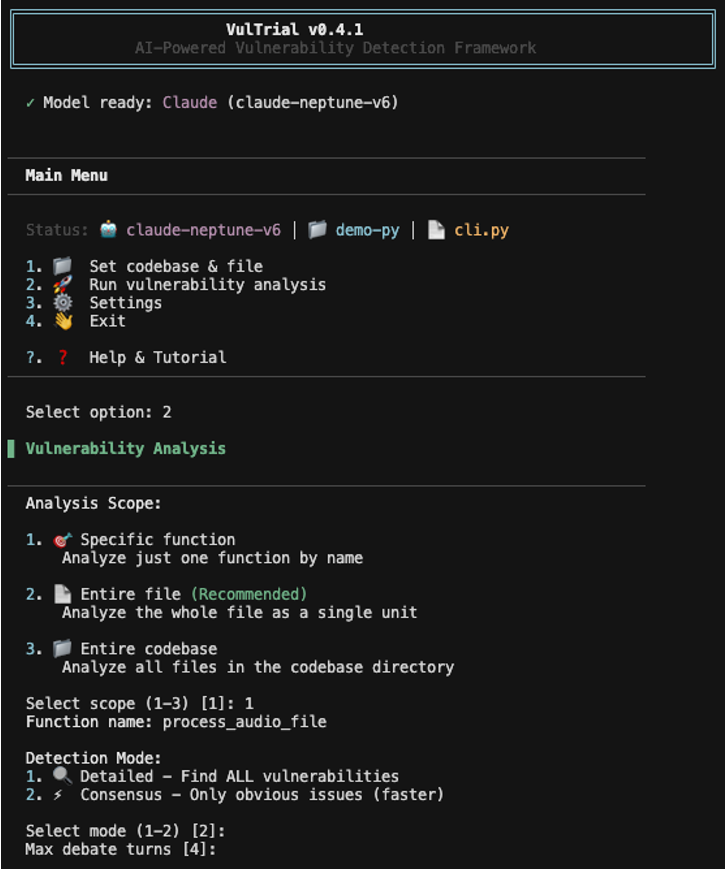
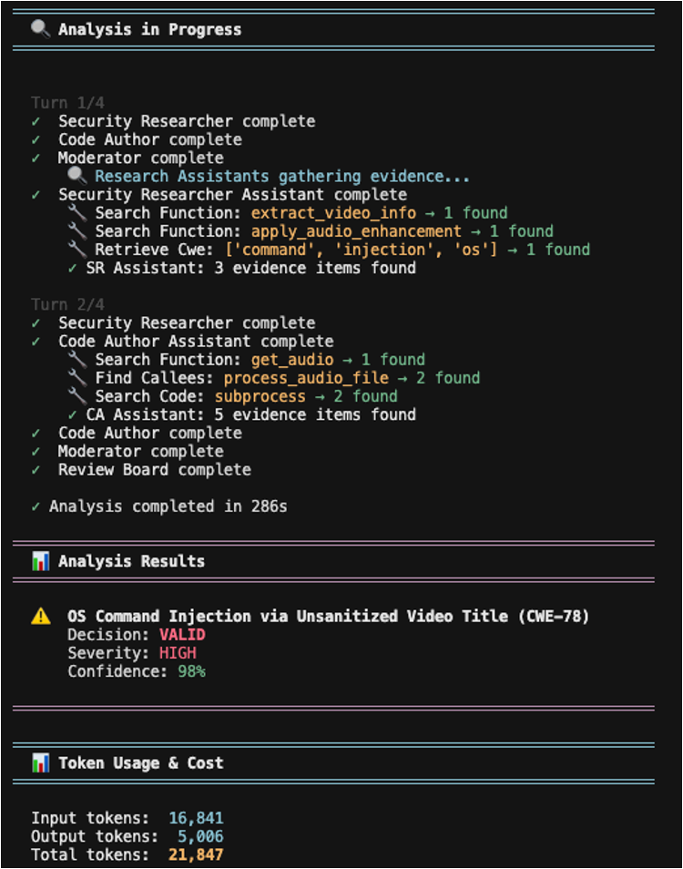

# VulTrial

AI agents that debate to find vulnerabilities in your code.

Think of it as a security review where a researcher finds bugs, the developer defends their code, and a moderator keeps things focused. At the end, a review board makes the final call.

## What is this?

VulTrial uses four AI agents that argue about whether your code has security vulnerabilities:

1. **Security Researcher** - Finds potential vulnerabilities
2. **Code Author** - Defends the code or suggests fixes
3. **Moderator** - Summarizes the debate and decides if more evidence is needed
4. **Review Board** - Makes final decisions

**What makes it unique:**
- Research assistants automatically search your codebase for evidence
- Smart coordination prevents duplicate searches (saves tokens & time)
- Multi-turn debate with evidence gathering ensures thorough analysis
- Supports Python, C/C++, Java, and JavaScript/TypeScript

Each agent has their own research assistant that can search through your codebase for evidence. The assistants coordinate intelligently - CA Assistant sees what SR Assistant already searched and gathers DIFFERENT evidence for defense. It's like a courtroom debate, but for code security.

```
SecurityResearcher → CodeAuthor → Moderator → [Need Evidence?]
                                                       ↓
                                                      YES
                                                       ↓
                                           SR Assistant searches first
                                         (finds attack evidence & CWE data)
                                                       ↓
                                            SR refines claims with evidence
                                                       ↓
                                          CA Assistant searches DIFFERENTLY
                                          (sees what SR searched, avoids duplicates)
                                          (finds defense evidence & mitigations)
                                                       ↓
                                            CA responds with evidence
                                                       ↓
                                              ReviewBoard Decision
```

## How does it work?

The agents debate in turns. The Security Researcher finds vulnerabilities, the Code Author responds with defenses or mitigations. If they disagree, their assistants search the codebase for evidence. This continues for a few rounds until the Review Board makes a final decision.

You can run it in two modes:
- **Detailed mode**: Finds every possible vulnerability (thorough but slower)
- **Consensus mode**: Only flags obvious, high-severity issues (fast scans)

The assistants can automatically:

**Search Tools:**
- Search for functions, classes, and methods in your codebase
- Find who calls a function (callers) and what it calls (callees)
- Trace multi-level call chains to understand data flow
- Track taint flow from sources to sinks (command injection, SQL injection, etc.)
- Track how variables are used across functions
- Search for code patterns (e.g., "subprocess", "eval", "shell=True")

**Context Tools:**
- Summarize files and list all functions
- Get file context (imports, dependencies, structure)
- Find and summarize README documentation
- Get high-level codebase overview

**Knowledge Base:**
- Retrieve official CWE vulnerability data (severity, exploitability, mitigation)
- Match vulnerabilities to CWE classifications with examples

**Smart Coordination:**
- CA Assistant sees what SR Assistant already searched
- Automatically avoids duplicate searches
- Focuses on gathering DIFFERENT evidence for defense

All of this happens automatically when agents need more information to settle a debate.

## Analysis Modes

**Detailed Mode** (default)
- Finds ALL potential vulnerabilities
- Deep debate on every issue
- Comprehensive evidence gathering
- Best for security audits and code reviews

**Consensus Mode** (fast)
- Only flags obvious, high-severity vulnerabilities (CWE-78, CWE-89, etc.)
- Skips minor or contested issues
- Focuses evidence gathering on critical issues only
- Great for CI/CD pipelines and quick scans

| Feature | Detailed | Consensus |
|---------|----------|-----------|
| Goal | Find everything | Find obvious critical issues |
| Speed | Slower | Faster (~2x) |
| Debate | All issues | High-severity only |
| Evidence | Comprehensive | Critical vulnerabilities only |
| Best for | Security audits | CI/CD, quick scans |

## What can it analyze?

Four clear analysis levels:

1. **Function Level**: `--codebase PATH --file FILE --function FUNC`
   - Analyzes just one specific function
   - Fastest and most focused

2. **Code Snippet Level**: `--codebase PATH --file FILE --code-snippet "code here"`
   - Analyzes the exact code snippet you provide
   - Matches the snippet in the file to get location/context (line numbers)
   - **Analyzes your provided snippet**, not the matched code from file
   - Can provide code directly OR a path to file containing the snippet
   - Smart fuzzy matching (handles whitespace, truncated lines, small code differences)
   - Automatically unescapes `\n`, `\t` from JSON-extracted snippets
   - Useful when analyzing specific versions or edited code

3. **File Level**: `--codebase PATH --file FILE`
   - Analyzes all functions in one file
   - Function-by-function analysis with file context

4. **Codebase Level**: `--codebase PATH`
   - Analyzes all source files in the codebase
   - Comprehensive security audit of entire project

Supports **Python**, **C/C++**, **Java**, and **JavaScript/TypeScript**. Auto-detects the language.

## Quick Start

### Interactive UI (Easiest)
```bash
./vultrial-ui
```

This gives you a nice colorful interface where you can:
- Browse and select files from your codebase
- See real-time progress as agents debate
- View results with syntax highlighting
- Track token usage and costs
- Everything saves to logs automatically

<div style="display: flex; gap: 20px;">
  
  
</div>

### Command Line

VulTrial now uses a clear three-level analysis structure:

```bash
# LEVEL 1: Analyze specific function
python -m app.main --codebase data/demo1 \
                   --file auth.c \
                   --function perform_admin_operation \
                   --model-type claude \
                   --model-id claude-3-5-sonnet-20241022

# LEVEL 2: Analyze entire file (all functions)
python -m app.main --codebase data/demo1 \
                   --file auth.c \
                   --model-type claude \
                   --model-id claude-3-5-sonnet-20241022

# LEVEL 3: Analyze entire file (all functions)
python -m app.main --codebase data/demo1 \
                   --file auth.c \
                   --model-type claude \
                   --model-id claude-3-5-sonnet-20241022

# LEVEL 4: Analyze entire codebase (all files)
python -m app.main --codebase data/demo1 \
                   --model-type claude \
                   --model-id claude-3-5-sonnet-20241022

# CODE SNIPPET: Provide code directly
python -m app.main --codebase data/demo1 \
                   --file auth.c \
                   --code-snippet "if (admin_check(user)) {
    perform_operation();
}" \
                   --model-type claude \
                   --model-id claude-3-5-sonnet-20241022

# OR provide a file containing the snippet
python -m app.main --codebase data/demo1 \
                   --file auth.c \
                   --code-snippet snippet.txt \
                   --model-type claude \
                   --model-id claude-3-5-sonnet-20241022

# Important: Code snippet analysis behavior
# - Analyzes YOUR PROVIDED SNIPPET (exactly as given)
# - Matching in file is ONLY for locating context (line numbers, file location)
# - This allows analyzing specific versions, edits, or extracted code
# - Codebase context retrieval still works (agents can search for evidence)
#
# Auto-detection:
# - Single line + valid path = loads from file
# - Multi-line or invalid path = treats as code
# - Quotes around paths are automatically stripped: 'path' or "path" → path
# - Literal escape sequences automatically converted: \n → newline, \t → tab
# 
# Smart two-strategy matching (for location):
# Strategy 1: If snippet looks like a function → Extract function name → Use robust function extractor
# Strategy 2: Fall back to fuzzy snippet matching:
#   - Whitespace differences (tabs, spaces, indentation)
#   - Truncated first/last lines (common in JSON extracts)
#   - Small code differences (>95% similarity accepted for large snippets)
# This provides maximum robustness for finding code in files

# Quick scan (consensus mode - faster)
python -m app.main --codebase data/demo1 \
                   --file auth.c \
                   --mode consensus \
                   --max-turns 2
```

### Python API
```python
from app.models import ClaudeModel
from app.pipeline import VulTrialPipeline
from app.utils import InputHandler

# Extract a function from a file
code, _, _ = InputHandler.extract_function_from_file("file.c", "vulnerable_func")

# Set up the model
model = ClaudeModel(
    model_id="claude-3-5-sonnet-20241022",
    temperature=0.7,
    max_tokens=32000
)

# Create pipeline
pipeline = VulTrialPipeline(
    model=model, 
    codebase_path="project/",
    enable_context_retrieval=True,
    analysis_mode="detailed"  # or "consensus" for fast mode
)

# Run analysis
metadata = InputHandler.prepare_input_metadata(
    file_path="file.c",
    function_name="vulnerable_func",
    codebase_path="project/"
)
results = pipeline.run(code, input_metadata=metadata)
```

## Installation

You'll need Python 3.10+ and an API key for your LLM provider.

```bash
# Install dependencies
pip install -r requirements.txt

# Or just what you need
pip install anthropic                # Claude
pip install openai                   # GPT  
pip install google-generativeai      # Gemini
```

Set up your API key:

```bash
export ANTHROPIC_API_KEY="your-key"    # Claude
export OPENAI_API_KEY="your-key"       # GPT
export GOOGLE_API_KEY="your-key"       # Gemini
export XAI_API_KEY="your-key"          # Grok
```

### C/C++ Backend (cscope)

For best C/C++ analysis, install cscope (optional; falls back automatically if missing).

Install on your OS:

- macOS (Homebrew):
  ```bash
  brew update && brew install cscope
  ```
- Ubuntu/Debian:
  ```bash
  sudo apt-get update && sudo apt-get install -y cscope
  ```
- Fedora:
  ```bash
  sudo dnf install -y cscope
  ```
- Arch Linux:
  ```bash
  sudo pacman -S cscope
  ```
- openSUSE:
  ```bash
  sudo zypper install -y cscope
  ```
- Windows:
  - Chocolatey:
    ```bash
    choco install cscope
    ```
  - MSYS2:
    ```bash
    pacman -S cscope
    ```

Verify installation:
```bash
cscope --version
```

Notes:
- If cscope is not installed, the C backend prints a warning and uses a fallback index automatically.
- Optional (improves extraction accuracy when available):
  - ctags (`brew install ctags` or your distro equivalent)
  - tree-sitter C/C++ bindings (advanced users)

### JavaScript/TypeScript Backend (ts-morph)

For best JavaScript/TypeScript analysis, install ts-morph via npm (optional; falls back to regex parsing if missing).

**Prerequisites**: Node.js 14+ and npm

Install Node.js on your OS:

- macOS (Homebrew):
  ```bash
  brew install node
  ```
- Ubuntu/Debian:
  ```bash
  sudo apt-get update && sudo apt-get install -y nodejs npm
  ```
- Fedora:
  ```bash
  sudo dnf install -y nodejs npm
  ```
- Arch Linux:
  ```bash
  sudo pacman -S nodejs npm
  ```
- Windows:
  - Download from [nodejs.org](https://nodejs.org/)
  - Or use Chocolatey: `choco install nodejs`

Install ts-morph:
```bash
cd app/context/search_js/
npm install
```

Verify installation:
```bash
node --version
npm --version
```

Notes:
- If ts-morph is not installed, the JS/TS backend uses regex-based parsing automatically.
- ts-morph provides accurate AST parsing using the TypeScript compiler.
- Regex fallback works for most common cases but may miss complex syntax.

## Cost Tracking

Want to know how much each analysis costs? Configure pricing once and VulTrial will show you token usage and costs after every run.

**Smart Evidence Coordination Saves Tokens:**
- CA Assistant automatically sees what SR Assistant searched
- No duplicate searches = fewer tokens used
- Efficient evidence gathering from both perspectives
- You only pay for unique, valuable evidence

### In the UI
```bash
./vultrial-ui
# Settings (4) → p. Set Pricing
# Enter: $3.00 for input, $15.00 for output (Claude Sonnet example)
```

### Command Line
```bash
python -m app.main --codebase project/ \
                   --file code.c \
                   --price-input 3.0 \
                   --price-output 15.0
```

### What you'll see
```
Input tokens:  12,450
Output tokens: 3,280
Total cost:    $0.0866
```

Common pricing (per million tokens):
- **GPT-4**: $2.50 / $10.00
- **Claude Sonnet**: $3.00 / $15.00  
- **Gemini Pro**: Free

## More Examples

```bash
# Analyze entire codebase
python -m app.main --codebase my_project/ \
                   --model-type claude \
                   --model-id claude-3-5-sonnet-20241022

# Analyze single file with context
python -m app.main --codebase my_project/ \
                   --file auth.c \
                   --model-type claude \
                   --model-id claude-3-5-sonnet-20241022

# Analyze specific function
python -m app.main --codebase my_project/ \
                   --file auth.c \
                   --function checkPassword \
                   --model-type claude \
                   --model-id claude-3-5-sonnet-20241022

# Save to directory (auto-generates timestamped files)
python -m app.main --codebase my_project/ \
                   --file test.py \
                   --output output/analysis-results
# Creates: output/analysis-results/test_TIMESTAMP.json
#          output/analysis-results/test_TIMESTAMP.txt
#          output/analysis-results/test_TIMESTAMP.detailed.txt
```

### More Options

```bash
# Consensus mode (faster, only obvious vulnerabilities)
python -m app.main --codebase project/ \
                   --file code.py \
                   --mode consensus \
                   --max-turns 2

# Change debate length
python -m app.main --codebase project/ \
                   --file code.py \
                   --max-turns 5

# Adjust temperature
python -m app.main --codebase project/ \
                   --file code.py \
                   --temperature 0.5

# Save to directory (recommended)
python -m app.main --codebase project/ \
                   --file code.py \
                   --output output/my-results

# Quiet mode
python -m app.main --codebase project/ \
                   --file code.py \
                   --quiet
```

### For Large Codebases

If you're analyzing huge projects with 500+ line functions, adjust the context limits:

```bash
python -m app.main --codebase linux_module/ \
                   --file kernel.c \
                   --max-evidence-items 10 \
                   --max-evidence-tokens 2000 \
                   --max-evidence-lines 400
```

### With Cost Tracking

```bash
python -m app.main --codebase project/ \
                   --file code.py \
                   --price-input 3.0 \
                   --price-output 15.0
```

## All Command Line Options

**Analysis Target (Required):**
- `--codebase` / `-c` - Path to codebase directory (required)
- `--file` / `-f` - Specific file to analyze (optional, relative to codebase or absolute)
- `--function` - Specific function name (optional, requires --file)
- `--code-snippet` - Code snippet to analyze or path to file containing snippet (optional, requires --file)

**Analysis Levels:**
- Codebase only: `--codebase PATH` → Analyzes all files
- Codebase + File: `--codebase PATH --file FILE` → Analyzes all functions in file
- Codebase + File + Function: `--codebase PATH --file FILE --function FUNC` → Analyzes one function
- Codebase + File + Snippet: `--codebase PATH --file FILE --code-snippet "code"` → Analyzes specific code block

**Model Selection:**
- `--model-type` / `-t` - Which LLM (openai, claude, gemini, grok) [default: openai]
- `--model-id` / `-m` - Specific model (gpt-4o, claude-3-5-sonnet-20241022, etc.)

**Output:**
- `--output` / `-o` - Output directory or file base name
  - Directory: Creates `filename_TIMESTAMP.json`, `.txt`, `.detailed.txt`
  - File base: Creates `base.json`, `base.txt`, `base.detailed.txt`
- `--quiet` / `-q` - Suppress verbose output

**Analysis Mode:**
- `--mode` - 'detailed' (find ALL vulnerabilities) or 'consensus' (only obvious ones) [default: detailed]
- `--max-turns` - Number of debate rounds (default: 4)
- `--temperature` - Model temperature 0-1 (default: 0.7)

**Cost Tracking:**
- `--price-input` - Cost per 1M input tokens (e.g., 3.0 for $3.00/M)
- `--price-output` - Cost per 1M output tokens (e.g., 15.0 for $15.00/M)

**Advanced Context Management:**
- `--max-evidence-items` - Max code snippets to retrieve (default: 5)
- `--max-evidence-tokens` - Max tokens per snippet (default: 1000)
- `--max-evidence-lines` - Max lines per snippet (default: 100, CLI default: 400)
- `--history-compression-turn` - When to compress history (default: 3)

## Project Structure

```
Vultrial_agent/
├── app/
│   ├── __init__.py
│   ├── main.py                 # Main entry point
│   ├── models/                 # LLM model implementations
│   │   ├── __init__.py
│   │   ├── base.py            # Abstract base model
│   │   ├── openai_model.py    # OpenAI implementation
│   │   ├── claude_model.py    # Claude implementation
│   │   ├── gemini_model.py    # Gemini implementation
│   │   └── grok_model.py      # Grok implementation
│   ├── agents/                 # Agent implementations
│   │   ├── __init__.py
│   │   ├── base_agent.py      # Abstract base agent
│   │   └── conversation_agent.py
│   ├── prompts/                # Agent prompts
│   │   ├── __init__.py
│   │   └── agent_prompts.py   # Role-specific prompts
│   ├── pipeline/               # Orchestration
│   │   ├── __init__.py
│   │   └── vultrial_pipeline.py
│   └── utils/                  # Utilities
│       ├── __init__.py
│       └── input_handler.py
├── data/                       # Example code files
├── output/                     # Output directory
├── reference/                  # Reference materials
├── requirements.txt
└── README.md
```

## Extending VulTrial

Want to add a new LLM provider? Create a file in `app/models/`, inherit from `BaseLLMModel`, implement `generate()` and `generate_with_metadata()`. Check existing models for examples.

Want to customize how agents behave? Edit the prompts in `app/prompts/agent_prompts.py`.

## Output Files

VulTrial generates three output files when using `--output`:

### 1. **JSON Results** (`filename_TIMESTAMP.json`)
Structured data perfect for automation and CI/CD:
```json
{
  "timestamp": "2025-10-28T21:28:05",
  "file_analyzed": "data/demo1/auth.c",
  "codebase": "data/demo1",
  "model": "claude (claude-3-5-sonnet-20241022)",
  "analysis_results": { /* Full pipeline results */ },
  "token_usage": {
    "input_tokens": 12450,
    "output_tokens": 3280,
    "total_tokens": 15730
  },
  "elapsed_time": 45.2,
  "analysis_level": "file",
  "analysis_mode": "detailed"
}
```

### 2. **Text Summary** (`filename_TIMESTAMP.txt`)
Human-readable summary with key findings:
```
VulTrial Analysis Summary
══════════════════════════════════════════════════════════════
Timestamp: 2025-10-28T21:28:05
File: data/demo1/auth.c
Model: claude (claude-3-5-sonnet-20241022)

Results:
[Vulnerability findings in readable format]

Token Usage:
Input:  12,450
Output: 3,280
Total:  15,730
```

### 3. **Detailed Log** (`filename_TIMESTAMP.detailed.txt`)
Complete debate transcript with:
- All agent prompts
- Turn-by-turn responses
- Evidence retrieved
- Full reasoning

### Output Modes

**Directory output (recommended):**
```bash
--output output/my-analysis
# Auto-generates timestamped files inside directory
```

**File base name:**
```bash
--output results
# Creates: results.json, results.txt, results.detailed.txt
```

## What you get

After analysis, you'll see:
- Turn-by-turn debate between agents
- Final decision in JSON format with confidence scores
- Severity levels for each vulnerability (low/medium/high/critical)
- Recommended actions prioritized
- Token usage and costs (if pricing configured)
- Three output formats: JSON, summary, detailed log

